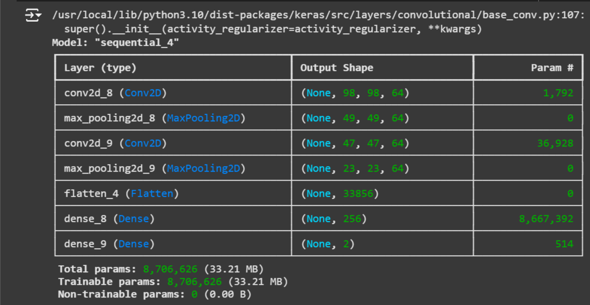
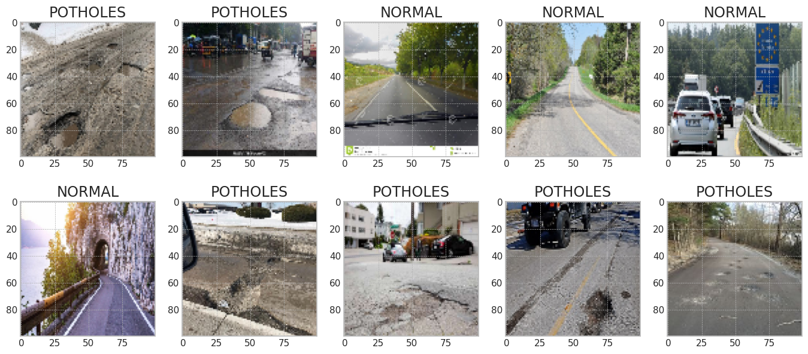
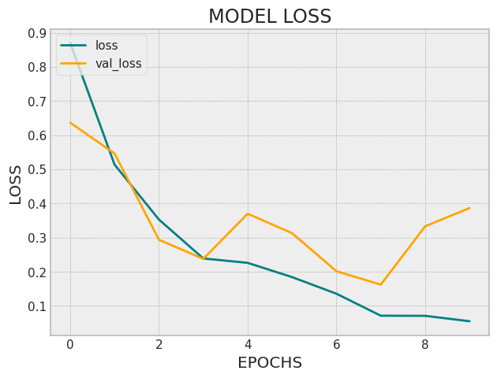

# Pothole Detection System

This project implements a Convolutional Neural Network (CNN)-based system to detect potholes in road images, aimed at enhancing road safety by identifying potentially hazardous road conditions.

## Project Overview

The **Pothole Detection System** classifies images of roads into two categories: **Plain Road** and **Pothole Road**. It leverages CNN architecture for high-accuracy classification and provides visual and audio outputs for predictions.

## Features

- **Image Preprocessing:** Automatically resizes and structures images for training.
- **Deep Learning Model:** Utilizes a CNN with two convolutional layers, pooling layers, and fully connected layers.
- **Audio Output:** Offers an audio message indicating whether the detected road section is plain or has a pothole.
- **Visualization:** Displays sample images from each category for reference.

## Tech Stack

- **Python**: Core language for data manipulation and model implementation.
- **OpenCV**: Used for image processing and manipulation.
- **TensorFlow & Keras**: Framework for building and training the CNN model.
- **gTTS (Google Text-to-Speech)**: Generates audio output.
- **tqdm**: Displays progress bars for lengthy processes.

## Setup & Installation

### Prerequisites

Ensure Python and pip are installed. Then install the necessary libraries:

```bash
pip install opencv-python gTTS tqdm tensorflow
```

### Clone the Repository

```bash
git clone <repository-url>
cd pothole-detection
```

### Dataset

Place your dataset images in two separate folders: `normal` (for plain road images) and `potholes` (for images of potholes). Update the paths in the code as follows:

```python
nor = '/path/to/normal/road/images'
pot = '/path/to/pothole/road/images'
```

## Running the Project

1. **Preprocess Images**: Run the `make_train_data` function to preprocess and load images into structured arrays.
2. **Train the Model**: Execute `model.fit` to train the CNN on your dataset. Default training parameters include 10 epochs and a 0.1 validation split.
3. **Evaluate**: Test the model's accuracy with `model.evaluate` and plot training metrics (accuracy and loss).
4. **Predict with Visualization & Audio**: Display predictions for test images with a label indicating "Plain Road" or "Pothole Road" and an audio message.

## Code Snippet for Prediction

Here’s a sample snippet to predict a single image and output both visual and audio results:

```python
import random
indx2 = random.randint(0, len(Y_test))
plt.imshow(X_test[indx2])
plt.show()

Y_pred = np.round(model.predict(X_test[indx2].reshape(1, 100, 100, 3)))
if Y_pred[0][0] == 1:
    op = "Plain Road"
else:
    op = "Pothole Road"

from gtts import gTTS
from IPython.display import Audio

gtts_obj = gTTS(text=op, lang="en", slow=False)
gtts_obj.save("/content/output.wav")
Audio("/content/output.wav")
```

## Project Outputs

The model achieves approximately **90% accuracy** on test data. Loss and accuracy trends across epochs are plotted to observe model improvement.







## Contributing

Contributions are welcome! Feel free to fork the repository, open issues, or submit pull requests to enhance functionality.
